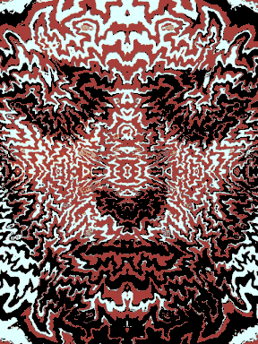
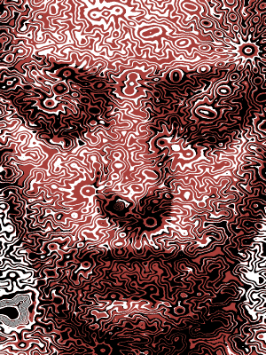

# halftone-gif-tool
Animated fractal halftone gif helper script

source of idea
https://billtavis.com/blogs/fractalism-is-the-new-cubism/making-of-trying-to-hold-it-together-screenprint

  

<a rel="cc:attributionURL" property="dct:title" href="https://github.com/hazarek/halftone-gif-tool">halftone-gif-tool</a> by <a rel="cc:attributionURL dct:creator" property="cc:attributionName" href="https://github.com/hazarek">hazarek</a> is licensed under <a rel="license" href="https://creativecommons.org/licenses/by-nc-sa/4.0">CC BY-NC-SA 4.0
