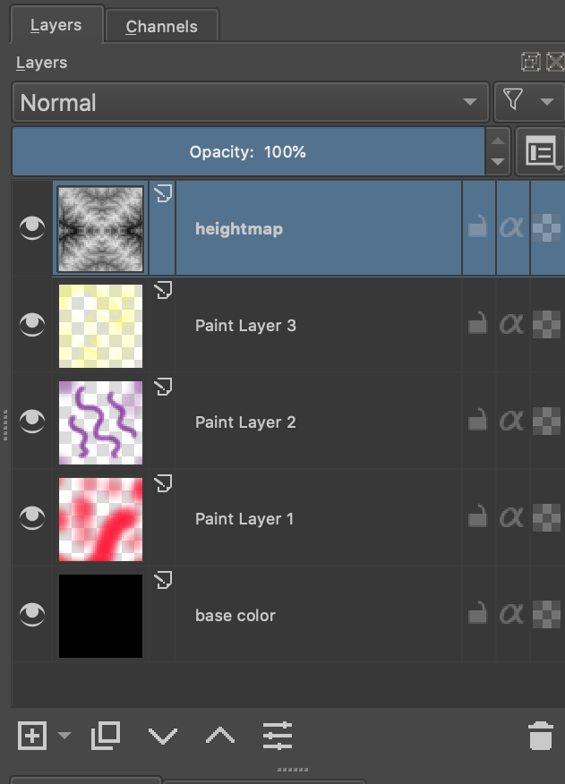
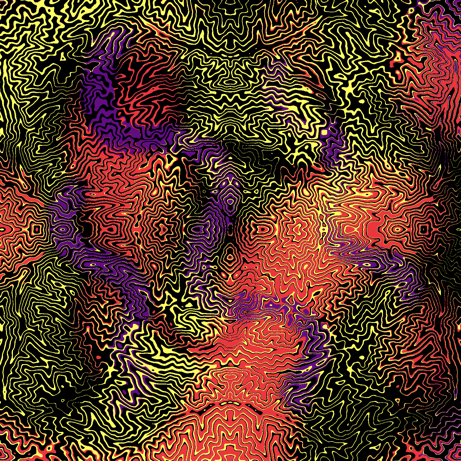

# halftone-gif-tool
Animated fractal halftone gif helper script

### Python3 Requirements
* Numpy
* Pillow

### input.ora layer structure

### Output GIF

### Samples
  

### Source of idea
https://billtavis.com/blogs/fractalism-is-the-new-cubism/making-of-trying-to-hold-it-together-screenprint

### See Also
* https://github.com/CraGL/Decompose-Single-Image-Into-Layers
* https://github.com/CraGL/fastLayerDecomposition