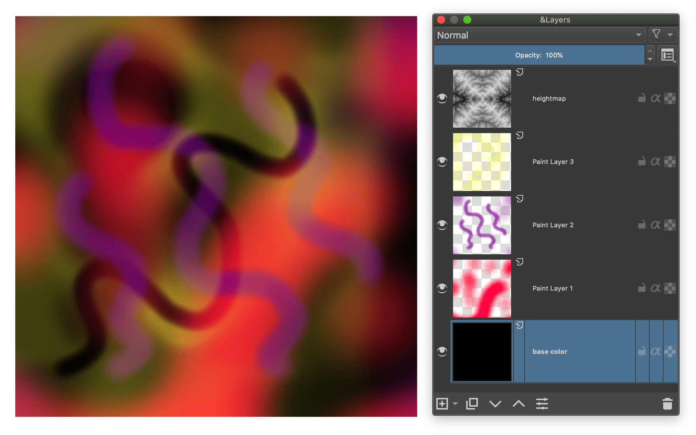

# halftone-gif-tool

Animated fractal halftone gif helper script

## Python3 Requirements

* Numpy
* Pillow

## Demo

input.ora ([Openraster](https://www.openraster.org/) format) layer structure; The bottom layer must be solid color. There should be a grayscale heightmap map at the top layer. This can be a computer generated fractal height map (these work well: [Hydraulic-Erosion](https://github.com/dandrino/terrain-erosion-3-ways#simulation), Mandelbrot), real [DEM images](https://blog23d.wordpress.com/2013/06/01/dem-visualisation-techniques-colour-mapping/) or any suitable gradient map. If you want to use photos instead of painting, you can use one of the following repositories
> **note**: png layers in the ora file must be the same size. `Krita > Image menu > Trim to image size`

- https://github.com/CraGL/fastLayerDecomposition
- https://github.com/CraGL/Decompose-Single-Image-Into-Layers



### Output GIF

```python
from halftone import Halftone as hf
test = hf("input.ora", step=1, period=12, waveform="sawtooth", adjust=False)
test.savegif("output.gif", scale=0.25, miliseconds=50, colour=128, sampling=3)
```


### Samples

<p float="left">
  
  
</p>

### Source of idea

https://billtavis.com/blogs/fractalism-is-the-new-cubism/making-of-trying-to-hold-it-together-screenprint
